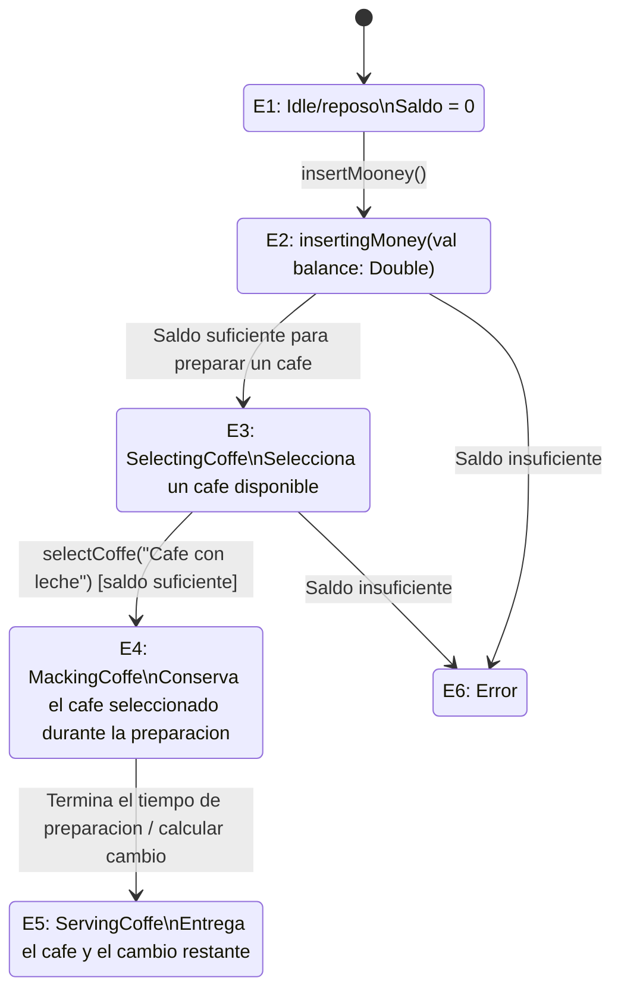

# Maquina de cafe

## Diagrama de estados

```mermaid
stateDiagram-v2
    [*] --> E1

    state "E1: Idle/reposo\nSaldo = 0" as E1
    state "E2: insertingMoney(val balance: Double)" as E2
    state "E3: SelectingCoffe\nSelecciona un cafe disponible" as E3
    state "E4: MackingCoffe\nConserva el cafe seleccionado durante la preparacion" as E4
    state "E5: ServingCoffe\nEntrega el cafe y el cambio restante" as E5
    state "E6: Error" as E6

    E1 --> E2 : insertMooney()
    E2 --> E3 : Saldo suficiente para preparar un cafe
    E2 --> E6 : Saldo insuficiente
    E3 --> E4 : selectCoffe("Cafe con leche") [saldo suficiente]
    E3 --> E6 : Saldo insuficiente
    E4 --> E5 : Termina el tiempo de preparacion / calcular cambio
```

El estado **Error** representa fallos del sistema, como un saldo insuficiente.
